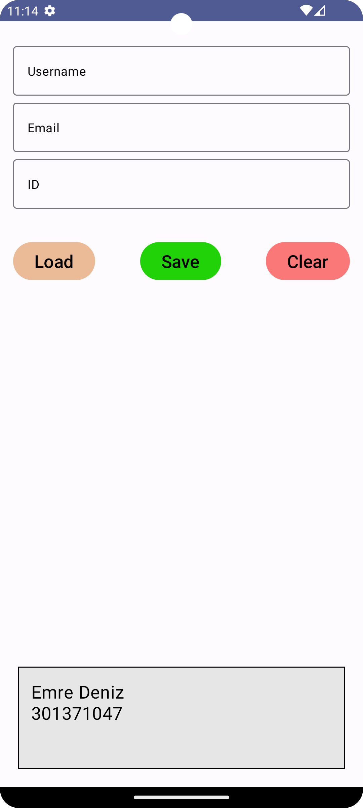

 # Android-Datastore-CRUD
CRUD operations in Android Datastore with Jetpack Compose

### HOW TO RUN:
```console
Open project in Android Studio
Run on Virtual or Physical Device
```

### FEATURES:
1. **Save** data to Datastore
2. **Load** data from Datastore
3. **Update** data in Datastore
4. **Clear** data in Datastore

### SCREENSHOTS:
<kbd></kbd>
